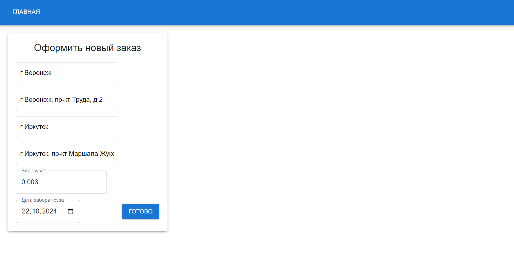
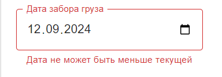
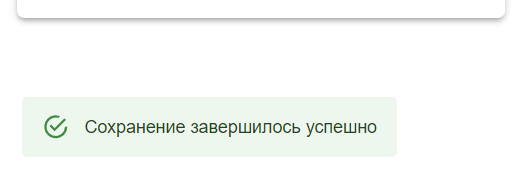
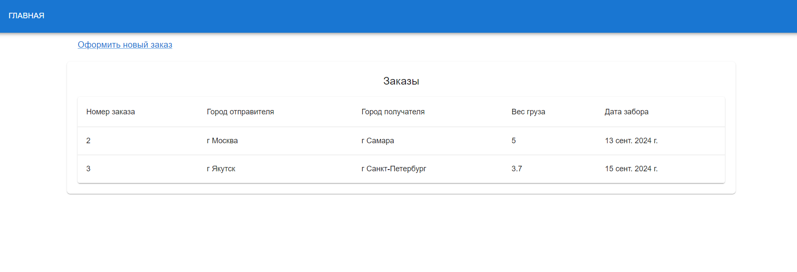
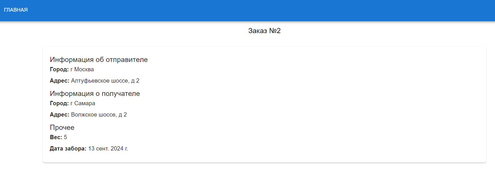

# Тестовое задание

### Подготовка окружения
- .NET 8 SDK
- PostgreSQL
- Node JS, v16.20.2

Также необходимо вызвать `npm install` в `Versta.TestTask/versta.front`

### Запуск
- Для запуска бекенда предварительно необходимо добавить собственный пароль к строку подключения в параметрах приложения
- Запуск фронтенда -  `npm start` в той же директории с  `npm install`

## Демо

Необходимо было создать три формы:

### Оформление заказа

Для автозаполнения и пользовательских подсказок было решено интегрироваться 
с сервисом DaData посредством использования библиотеки 'react-dadata'. Данный инструмент также существенно упростил 
валидацию входных параметров. Лимит бесплатных запросов - 1000/сут.

Система позволит отправить форму лишь при соблюдении всех установленных инвариантов, проверка производится на 
стороне фронтенда.

При успешном добавлении заказа пользователь получает соответствующее уведомление

### Список заказов
Представлен в виде таблицы с кликабельными стркоками, предтавляет превью заказов

### Информация о заказе
Содержит более детальную информацию о каждом заказе

